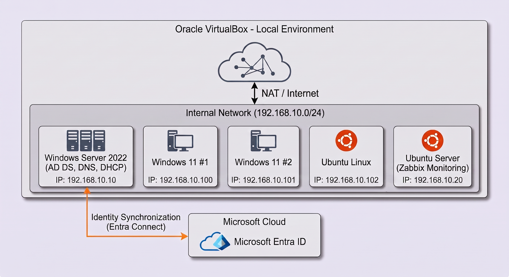

# AD-Lab — Active Directory, Entra ID and Zabbix

[Wersja polska](README_PL.md)

A home lab I built to practise IT administration. I configured an Active Directory domain, network services, workstation management through Group Policy, account synchronisation with Microsoft Entra ID, and Zabbix monitoring. I also wrote PowerShell scripts for routine user account tasks.

## Environment

- **Virtualisation:** Oracle VirtualBox
- **Operating systems:** Windows Server 2022, Windows 11, Ubuntu Linux
- **Local network:** `192.168.10.0/24`
- **Domain controller:** `192.168.10.10`
- **Lab domain:** `bartek.com`

### Active Directory and network services

- Set up an AD DS domain controller.
- Created an OU structure for users, administrative accounts, service accounts, and workstations.
- Created user accounts and security groups.
- Configured DNS and authorised a DHCP server with the address range `192.168.10.100–192.168.10.200`.

Screenshots: [AD structure](images/ad_structure.png), [DHCP scope](images/dhcp_scope.png), [DHCP leases](images/dhcp_leases.png), [DNS](images/dns.png).

### Group Policy and shared resources

- Configured Google Chrome deployment through Group Policy using an MSI package.
- Set up automatic mapping of the `Z:` network drive.
- Configured share and NTFS permissions for shared resources.

Screenshots: [software deployment](images/gpo_chrome.png), [drive mapping](images/mapped_drive.png).

### Ubuntu domain integration

- Joined Ubuntu to Active Directory using `realmd` and `sssd`.
- Verified login with a domain account.

Screenshot: [Ubuntu domain integration](images/ubuntu_ad.png).

### Microsoft Entra ID synchronisation

- Installed and configured Microsoft Entra Connect Sync.
- Synchronised user accounts from selected OUs to Entra ID.
- Checked synchronisation results locally and in the Entra admin centre.

Screenshots: [Entra Connect Sync](images/entra_connect_synchro.png), [accounts in Entra ID](images/entra_id.png).

### Zabbix monitoring

- Set up monitoring for the domain controller and workstations.
- Configured Zabbix Agent deployment on Windows through a Group Policy startup script.
- Used templates and low-level discovery to monitor services and flag problems.

Screenshot: [Zabbix monitoring](images/zabbix_monitoring.png).

## Scripts

| Script | Purpose |
| --- | --- |
| [Create_ADusers.ps1](scripts/Create_ADusers.ps1) | Creates accounts from a CSV file in a specified OU, generates usernames, and requires a password change at first login. Skips existing usernames. |
| [user_raport.ps1](scripts/user_raport.ps1) | Exports enabled accounts from a specified OU to CSV, including first name, surname, username, and email address. |
| [inactive_users.ps1](scripts/inactive_users.ps1) | Disables accounts based on `LastLogonDate` and a configurable threshold, defaulting to 90 days. Sets the account description to include the disable date. |
| [ZabbixInstall.bat](scripts/ZabbixInstall.bat) | Installs Zabbix Agent from a network share if the agent executable is not found. |

Examples: [account creation](images/powershell_create_users.png), [CSV report](images/powershell_raport.png), [disabling inactive accounts](images/powershell_inactive_users.png).

The scripts were written for this lab and contain environment-specific settings.
