# Enterprise IT Infrastructure & Hybrid Identity Lab

## Project Overview
This project is a comprehensive simulation of a corporate IT infrastructure built from the ground up. I designed, deployed, and administered a multi-platform virtual network using Windows Server 2022, Windows 11, and Ubuntu Linux. 

The primary objective of this lab is to demonstrate practical, hands-on experience in system administration, network configuration, centralized identity management, and automated software deployment in a heterogeneous environment.

---

## Architecture & Topology

### Environment Specifications:
* **Hypervisor:** Oracle VirtualBox
* **Network Subnet:** `192.168.10.0/24` (Internal Network)
* **Domain Controller:** Windows Server 2022 (Static IP: `192.168.10.10`)
* **Client Workstations:** Windows 11 & Ubuntu Linux (Dynamic IPs via DHCP)
* **Domain Name:** `bartek.com`

---

## Key Implementations & Technologies

### 1. Active Directory Domain Services (AD DS)
Designed a logical, Enterprise-grade Organizational Unit (OU) structure to effectively separate administrative accounts, service accounts, workstations, and departmental users (e.g., IT, HR, Video Department).
* Created and managed user lifecycles, security groups, and organizational units.

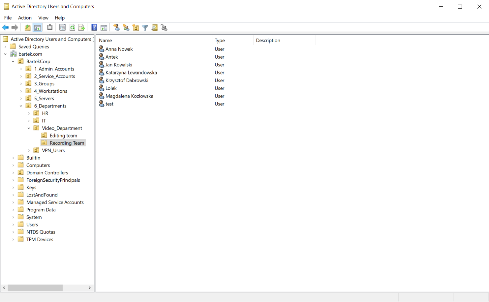

### 2. Core Network Services (DHCP & DNS)
Configured core networking roles to ensure seamless communication and dynamic IP allocation across the domain.
* **DHCP Configuration:** Authorized a DHCP server with a defined IPv4 scope (`192.168.10.100` - `192.168.10.200`) to automatically assign IP addresses to client machines.
* **DNS Configuration:** Maintained Forward Lookup Zones ensuring accurate A-record resolution for Windows clients and statically added Linux hosts.

**DHCP Scope & Leases:**
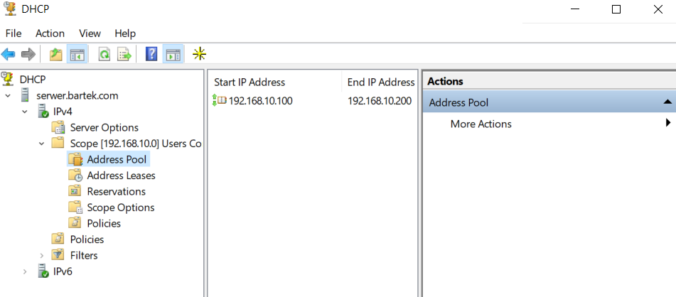
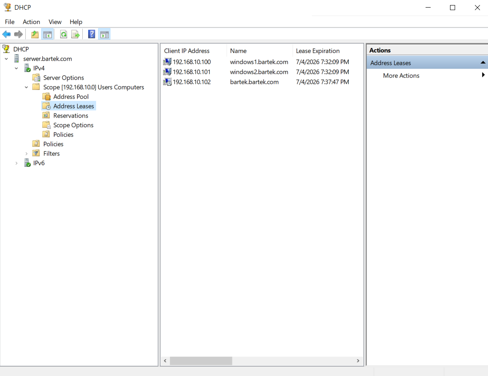

**DNS Records:**
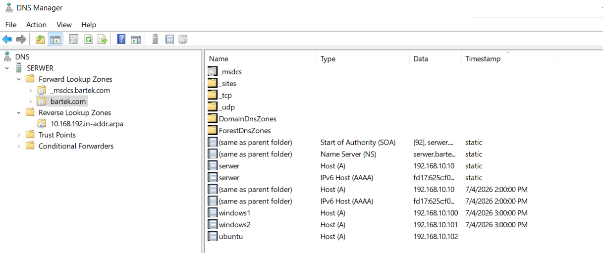

### 3. Group Policy Objects (GPO) & Automation
Implemented centralized management policies to standardize the environment, automate administrative tasks, and improve user experience (UX).
* **Software Deployment:** Configured silent, automated network installation of software (Google Chrome `.msi`) to all machines within the Workstations OU.
* **Resource Sharing:** Automated the mapping of corporate network drives (Drive `Z:`) using Group Policy Preferences (Drive Maps) combined with strict NTFS and Share permissions.

**GPO Drive Mapping Configuration:**
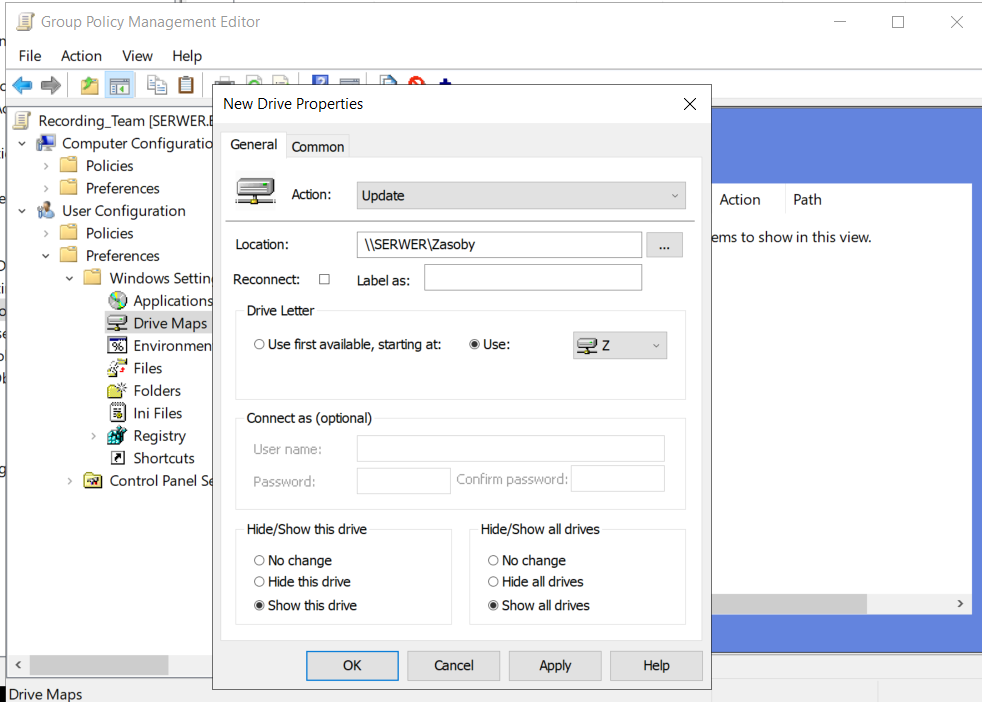

**GPO Automated Software Deployment:**
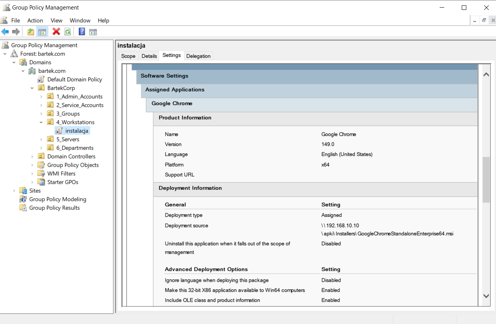

### 4. Cross-Platform Integration (Linux & Windows)
Successfully configured a heterogeneous network by joining an Ubuntu Linux workstation to the Microsoft Active Directory domain.
* Utilized `realmd` and `sssd` packages to allow seamless Linux logins using centralized AD domain credentials, proving cross-platform system administration capabilities.

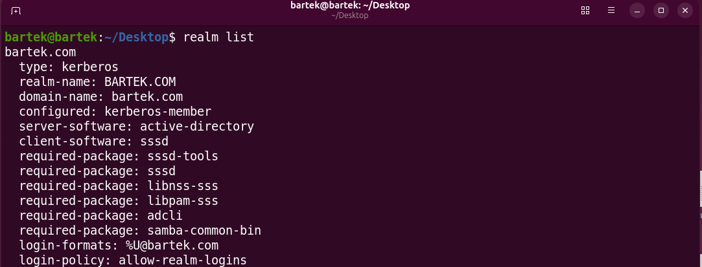

### 5. Identity Lifecycle Automation (PowerShell)
Developed and executed modular PowerShell scripts (available in the `/scripts` directory) to automate the entire employee identity lifecycle, demonstrating efficiency and security awareness.
* **Onboarding (Provisioning):** Automated bulk creation of user accounts from `.csv` files, standardizing naming conventions, UPNs, and assigning them to proper OUs.
  * **Script:** [`Create_ADusers.ps1`](scripts/Create_ADusers.ps1)
* **Reporting (Auditing):** Created a data pipeline to export clean, formatted `.csv` reports of active employees for HR and management audits.
  * **Script:** [`user_raport.ps1`](scripts/user_raport.ps1)
* **Offboarding (Security Audit):** Built a security script to identify and automatically disable stale/inactive accounts, reducing the attack surface and appending timestamped notes for other administrators.
  * **Script:** [`inactive_users.ps1`](scripts/inactive_users.ps1)

**Bulk User Creation (Onboarding):**
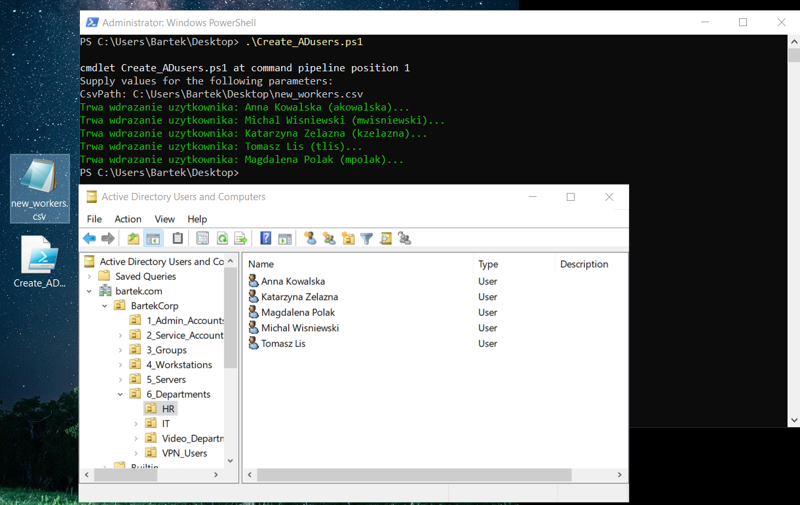

**Active User Reporting (Export):**
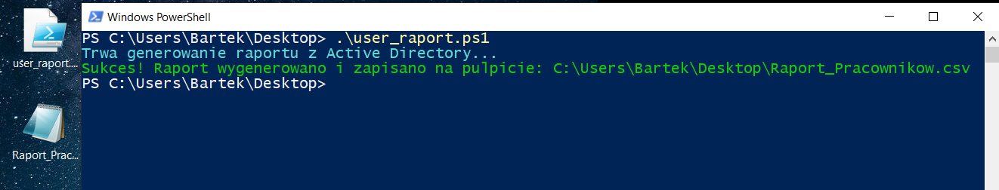

**Stale Account Cleanup (Security Audit):**
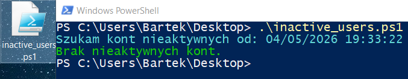

### 6. Hybrid Identity & Cloud Integration
Configured a hybrid IT environment by integrating the on-premises Active Directory with Microsoft Entra ID (formerly Azure AD) to enable centralized identity management and Single Sign-On (SSO) capabilities.
* Deployed and configured **Microsoft Entra Connect Sync** on the local Windows Server.
* Successfully synchronized local OUs and user attributes to the Microsoft 365 cloud environment, establishing a seamless Hybrid Identity architecture.

**Cloud Verification (Synced Users in Microsoft Entra admin center):**
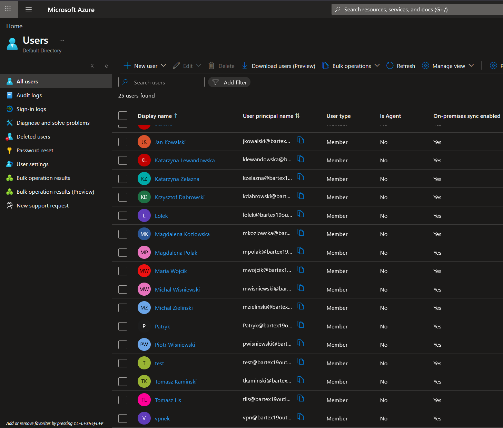

**On-Premises Verification (Synchronization Service Operations):**
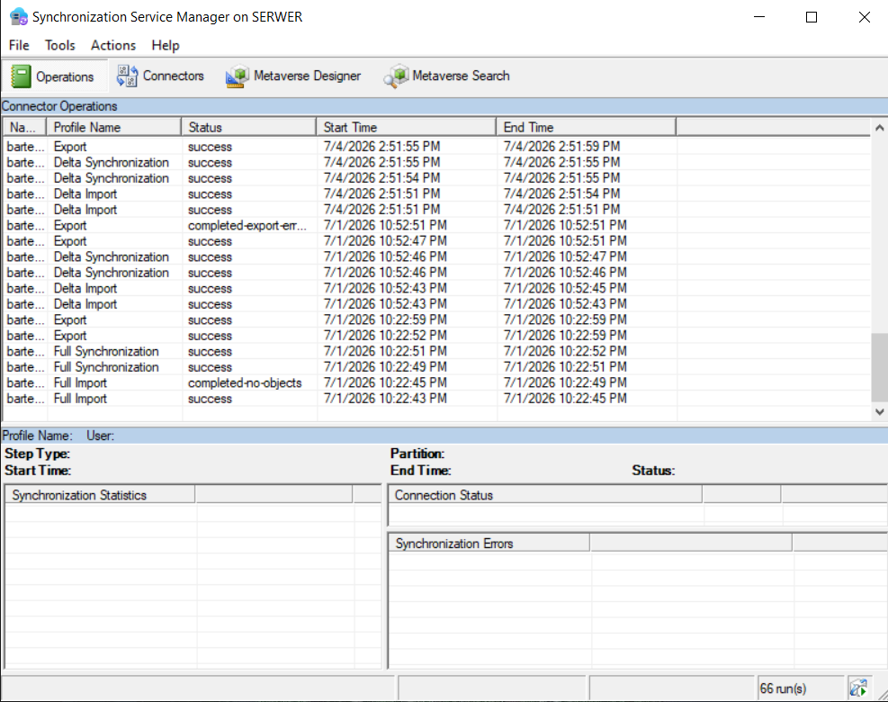