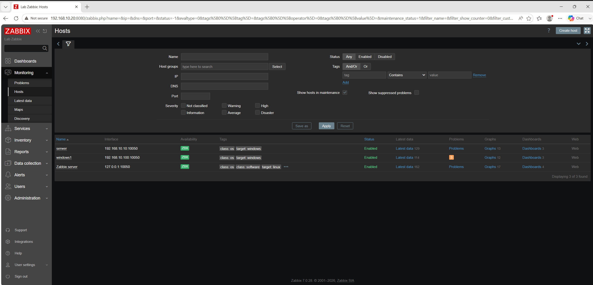

# Laboratorium Infrastruktury IT i Tożsamości Hybrydowej (Enterprise IT)

## Przegląd Projektu
Projekt ten to kompleksowa symulacja firmowej infrastruktury IT zbudowanej od podstaw. Zaprojektowałem, wdrożyłem i administrowałem wieloplatformową siecią wirtualną opartą na systemach Windows Server 2022, Windows 11 oraz Ubuntu Linux. 

Głównym celem tego laboratorium jest zaprezentowanie praktycznych umiejętności z zakresu administracji systemami, konfiguracji sieci, scentralizowanego zarządzania tożsamością oraz automatycznego wdrażania oprogramowania w środowisku heterogenicznym.

---

## Architektura i Topologia

### Specyfikacja środowiska:
* **Hypervisor:** Oracle VirtualBox
* **Podsieć:** `192.168.10.0/24` (Sieć wewnętrzna)
* **Kontroler Domeny:** Windows Server 2022 (Statyczny IP: `192.168.10.10`)
* **Stacje robocze:** Windows 11 i Ubuntu Linux (Dynamiczne IP przydzielane z DHCP)
* **Nazwa domeny:** `bartek.com`

---

## Kluczowe Wdrożenia i Technologie

### 1. Usługi Domenowe Active Directory (AD DS)
Zaprojektowałem logiczną, korporacyjną strukturę Jednostek Organizacyjnych (OU), aby skutecznie oddzielić konta administracyjne, konta usług, stacje robocze oraz użytkowników z poszczególnych działów (np. IT, HR, Dział Wideo).
* Tworzyłem i zarządzałem cyklem życia użytkowników, grupami zabezpieczeń oraz jednostkami organizacyjnymi.

### 2. Podstawowe Usługi Sieciowe (DHCP i DNS)
Skonfigurowałem kluczowe role sieciowe, aby zapewnić płynną komunikację i dynamiczne przydzielanie adresów IP w domenie.
* **Konfiguracja DHCP:** Autoryzowałem serwer DHCP ze zdefiniowanym zakresem IPv4 (`192.168.10.100` - `192.168.10.200`) do automatycznego przydzielania adresów IP stacjom klienckim.
* **Konfiguracja DNS:** Utrzymywałem strefy wyszukiwania do przodu (Forward Lookup Zones), zapewniając poprawne rozwiązywanie rekordów A dla klientów Windows oraz statycznie dodanych hostów Linux.

**Zakres i Dzierżawy DHCP:**

**Rekordy DNS:**

### 3. Obiekty Zasad Grupy (GPO) i Automatyzacja
Wdrożyłem zasady scentralizowanego zarządzania, aby ustandaryzować środowisko, zautomatyzować zadania administracyjne i poprawić wygodę użytkowników (UX).
* **Wdrażanie oprogramowania:** Skonfigurowałem cichą, automatyczną instalację sieciową oprogramowania (Google Chrome `.msi`) na wszystkich maszynach w jednostce OU Workstations.
* **Udostępnianie zasobów:** Zautomatyzowałem mapowanie firmowych dysków sieciowych (Dysk `Z:`) przy użyciu preferencji zasad grupy (Drive Maps) w połączeniu z rygorystycznymi uprawnieniami NTFS i udostępniania.

**Konfiguracja mapowania dysku GPO:**

**Automatyczne wdrażanie oprogramowania GPO:**

### 4. Integracja Międzyplatformowa (Linux i Windows)
Pomyślnie skonfigurowałem sieć heterogeniczną, podłączając stację roboczą Ubuntu Linux do domeny Microsoft Active Directory.
* Wykorzystałem pakiety `realmd` i `sssd`, aby umożliwić bezproblemowe logowanie do systemu Linux przy użyciu scentralizowanych poświadczeń domeny AD, dowodząc umiejętności administracji systemami wieloplatformowymi.

### 5. Automatyzacja Cyklu Życia Użytkownika (PowerShell)
Napisałem i wdrożyłem modułowe skrypty PowerShell (dostępne w katalogu `/scripts`), aby zautomatyzować pełen cykl życia tożsamości pracownika, wykazując się wydajnością i dbałością o bezpieczeństwo.
* **Onboarding (Tworzenie kont):** Zautomatyzowałem masowe tworzenie kont użytkowników z plików `.csv`, standaryzując konwencje nazewnictwa, UPN oraz przypisując konta do odpowiednich jednostek organizacyjnych (OU).
  * **Skrypt:** [`Create_ADusers.ps1`](scripts/Create_ADusers.ps1)
* **Raportowanie (Audyt):** Stworzyłem mechanizm eksportu czystych, sformatowanych raportów `.csv` o aktywnych pracownikach na potrzeby działu HR i audytów zarządczych.
  * **Skrypt:** [`user_raport.ps1`](scripts/user_raport.ps1)
* **Offboarding (Audyt bezpieczeństwa):** Zbudowałem skrypt bezpieczeństwa, który identyfikuje i automatycznie wyłącza przestarzałe/nieaktywne konta, zmniejszając powierzchnię ataku i dodając notatki ze znacznikami czasu dla innych administratorów.
  * **Skrypt:** [`inactive_users.ps1`](scripts/inactive_users.ps1)

**Masowe tworzenie użytkowników (Onboarding):**

**Raportowanie aktywnych użytkowników (Eksport):**

**Czyszczenie martwych kont (Audyt bezpieczeństwa):**

### 6. Tożsamość Hybrydowa i Integracja z Chmurą
Skonfigurowałem hybrydowe środowisko IT, integrując lokalne Active Directory z Microsoft Entra ID (dawniej Azure AD), aby umożliwić scentralizowane zarządzanie tożsamością i logowanie jednokrotne (SSO).
* Wdrożyłem i skonfigurowałem narzędzie **Microsoft Entra Connect Sync** na lokalnym serwerze Windows Server.
* Pomyślnie zsynchronizowałem lokalne jednostki organizacyjne i atrybuty użytkowników do środowiska chmurowego Microsoft 365, ustanawiając spójną architekturę tożsamości hybrydowej.

**Weryfikacja w Chmurze (Zsynchronizowani użytkownicy w portalu Microsoft Entra):**

**Weryfikacja lokalna (Operacje usługi synchronizacji Entra Connect):**

### 7. Monitorowanie Infrastruktury (Zabbix)
Wdrożyłem system Zabbix do aktywnego monitorowania kondycji, wydajności i dostępności kontrolera domeny oraz stacji roboczych.
* **Automatyzacja wdrażania agenta:** Skonfigurowałem ciche, automatyczne wdrażanie agenta Zabbix Agent na stacjach klienckich Windows za pomocą obiektów zasad grupy (GPO) i niestandardowego skryptu startowego (.bat).
* **Monitorowanie usług:** Wykorzystałem mechanizmy automatycznego wykrywania (LLD) oraz wbudowane szablony do szczegółowego monitorowania kluczowych usług i alertowania.
  * **Skrypt:** [`ZabbixInstall.bat`](scripts/ZabbixInstall.bat)

**Panel Zabbix i Monitorowanie Hostów:**
